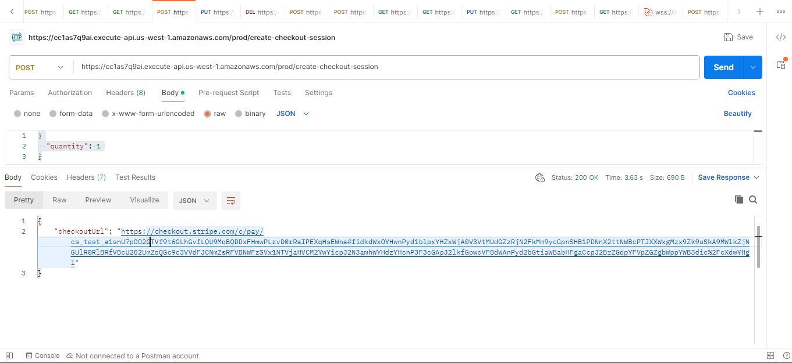
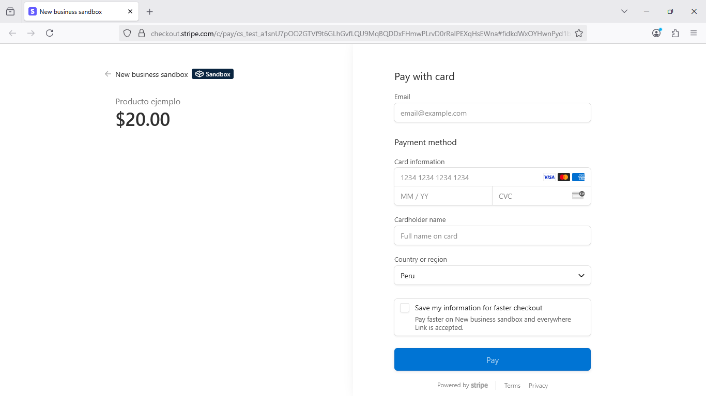

# Serverless Stripe Checkout (Java 21 + AWS SAM)

Este proyecto demuestra una arquitectura moderna y segura para manejar pagos con Stripe utilizando funciones Lambda en AWS, implementadas en Java 21 y con manejo de JSON usando Moshi.

## 🧭 Descripción General

- **Lenguaje:** Java 21
- **Framework:** AWS SAM (Serverless Application Model)
- **Integración de pagos:** Stripe Checkout
- **Seguridad:** Stripe Webhooks firmados + AWS Secrets Manager
- **JSON:** Moshi

## 📊 Arquitectura

```plaintext
[Cliente] ---> [API Gateway] ---> [Lambda - CreateCheckoutSessionHandler]
                               |
                               ---> [Lambda - StripeWebhookHandler] <--- [Stripe]
```

## 📦 Servicios Utilizados

- **AWS Lambda** – Ejecuta lógica backend sin servidor
- **Amazon API Gateway** – Expone endpoints REST para frontend o clientes
- **AWS Secrets Manager** – Almacena las claves secretas de Stripe
- **Stripe API** – Plataforma de pagos
- **AWS SAM** – Infraestructura como código y despliegue automático

## 🧪 Modo Test vs Modo Live

Este proyecto está listo para trabajar en modo **Test**. Puedes migrar fácilmente a **Live**:

- Actualiza tu clave secreta `STRIPE_API_KEY` en Secrets Manager con el valor de producción
- Configura correctamente los webhooks en el dashboard de Stripe Live
- Vuelve a desplegar tu stack

## 📁 Estructura del Proyecto

```
serverless-stripe-checkout/
├── src/
│   └── main/java/com/checkout/
│       ├── CreateCheckoutSessionHandler.java
│       └── StripeWebhookHandler.java
├── template.yaml
├── README.md
└── .github/workflows/deploy.yml
```

## 🔐 Secretos

Este proyecto usa dos secretos en AWS Secrets Manager:

1. **stripe-api-key**  

2. **stripe-webhook-secret**  


## 🛠 Despliegue

Requisitos:

- AWS CLI configurado
- Stripe cuenta modo test
- SAM CLI instalado

### Crear los secretos:

### Desplegar con SAM:

```bash
sam build
sam deploy --guided
```

## 🔄 Endpoints

Una vez desplegado, obtendrás dos endpoints:

- **POST /create-checkout-session** → Crea una sesión de pago de Stripe
- **POST /stripe-webhook** → Recibe eventos de Stripe

## 💳 Probar Pagos

1. Haz un POST a `/create-checkout-session`
2. Recibe una URL como `https://checkout.stripe.com/pay/cs_test_...`
3. Ábrela en el navegador y paga con una tarjeta de prueba como:
   ```
   4242 4242 4242 4242
   12/34   123   12345
   ```

## 🧪 Webhook

Configura un webhook en Stripe:

- URL: `https://.../stripe-webhook`
- Eventos: `checkout.session.completed` (mínimo)
- Guarda el `Webhook Signing Secret` (`whsec_...`) en Secrets Manager
>>>>>>> 49322e2 (Checkout)

---

## ⚙️ Arquitectura

```text
Cliente (Web/Frontend)
    ↓
API Gateway REST
    ↓               ↘
Lambda: CreateCheckoutSessionHandler   Lambda: StripeWebhookHandler
    ↓                                     ↓
Stripe Checkout                         Validación de eventos firmados
    ↓                                     ↓
Pago realizado                        Procesamiento (Webhook)
```

---

## 🧪 Endpoints

| Método | Ruta                    | Descripción                          |
|--------|-------------------------|--------------------------------------|
| POST   | /create-checkout-session | Crea una sesión de pago Stripe       |
| POST   | /stripe-webhook         | Recibe eventos Stripe (webhook)      |

---

## 🔐 Configuración de secretos

Se utilizan secretos en AWS Secrets Manager:

- `stripe-api-key`: tu clave secreta
- `stripe-webhook-secret`: tu clave de firma

Estos son referenciados automáticamente en el archivo `template.yaml`:

```yaml
STRIPE_API_KEY
STRIPE_WEBHOOK_SECRET
```

---

## 🚀 Despliegue con AWS SAM

1. Instala SAM CLI: https://docs.aws.amazon.com/serverless-application-model/latest/developerguide/install-sam-cli.html
2. Compila:
```bash
mvn clean package
```
3. Despliega:
```bash
sam deploy --guided
```

---

## ✅ Dependencias destacadas

- `stripe-java`: cliente oficial para operaciones con Stripe
- `moshi`: JSON moderno y liviano
- `aws-lambda-java-core` y `aws-lambda-java-events`: integración nativa con Lambda y API Gateway

---

## 📁 Estructura del proyecto

```
serverless-stripe-checkout/
├── src/main/java/com/checkout/
│   ├── CreateCheckoutSessionHandler.java
│   ├── StripeWebhookHandler.java
│   └── ApiGatewayResponse.java
├── template.yaml
├── pom.xml
└── README.md
```

---

## 📚 Referencias

- [Stripe Checkout Docs](https://stripe.com/docs/checkout)
- [Stripe Webhooks](https://stripe.com/docs/webhooks)
- [AWS SAM](https://docs.aws.amazon.com/serverless-application-model/)
- [Moshi](https://github.com/square/moshi)

---

## 🧠 Demostración

✅ Backend Serverless desarrollado
   - 🏗️ Infraestructura
     -    AWS SAM: para definir y desplegar la infraestructura como código.
     -    API Gateway: expone endpoints públicos (como /prod/create-checkout-session).
     -    AWS Lambda (Java 21): contiene la lógica del backend en funciones individuales.
     -    AWS Secrets Manager: almacena seguros los secretos de Stripe (API_KEY, WEBHOOK_SECRET).

   - 🧠 Lógica del backend
     -    El endpoint POST /create-checkout-session:
     -    Recibe un quantity desde el frontend o Postman. 
     -    Usa el SDK de Stripe para crear una sesión de pago.
     -    Devuelve un checkoutUrl para redirigir al usuario a pagar.
     -    Está autenticado y desplegado en entorno dev/prod correctamente vía GitHub Actions y SAM.

   - 🔐 Seguridad
      -   Accede a Stripe de forma segura con IAM y Secrets Manager.
      -   Despliegue automatizado con pipeline GitHub Actions usando gh secret.

   - Java
     - 
     
   - Postman
     -      
     
   - Stripe
     - Pantalla de pago de stripe con el producto y pago definido
     - 

---

## 🚀 Resumen

     - Este proyecto constituye un microservicio de pagos y únicamente sirve para crear una sesión de pago usando la pasarela oficial de Stripe.


## 🧑 Contacto

**Paul Rivera**
- Bachiller en Administración. Universidad ESAN
- AWS Certified Solutions Architect - Associate
- Oracle Java EE Master Developer